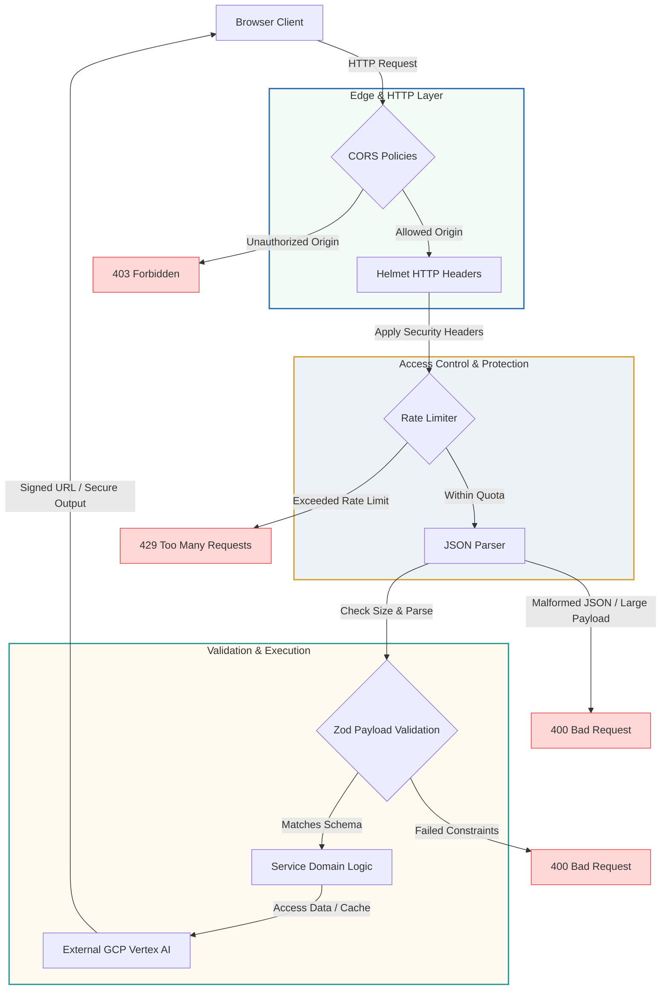

# Security Architecture: EcoQuest

This document diagrams and explains the security architecture of the EcoQuest platform, detailing the flow of request processing and the layers of defense applied to incoming transactions.

---

## 1. Security Architecture Diagram

The flowchart below visualizes how an incoming request from the client browser is processed and validated as it traverses the security layers of the EcoQuest API server:

---

## 2. Deep-Dive: The 5 Defensive Security Layers

### Layer 1: Edge & CORS Security
- **Origin Restricting**: The CORS middleware acts as the primary gatekeeper. Requests originating from unauthorized domains are blocked at the TCP/HTTP connection handshake phase.
- **HTTP Header Injection**: Express `helmet` automatically injects security headers (`X-Frame-Options`, `Content-Security-Policy`, etc.) into every response stream, ensuring client browsers run the web application in a sandboxed, secure context.

### Layer 2: Rate Limiting
- **Global Limits**: A standard limit of 200 requests per 15 minutes is applied globally to prevent server resource starvation.
- **AI Analytics Route Limits**: The `/api/analyze` route is limited to 10 requests per minute to prevent financial exploitation of Gemini.
- **Veo Video Generation Limits**: The `/api/video` route is restricted to 2 requests per minute per IP to control Google Veo 3.1 compute resource consumption.

### Layer 3: Payload Parsing Security
- **Max Content Size**: Enforced through `express.json({ limit: '256kb' })`. This protects the server against Buffer Overflow and heap exhaustion attacks using extremely large JSON payloads.
- **MIME Checking**: Enforces `application/json` formatting for API endpoints.

### Layer 4: Schema Validation (Zod)
- **Strict Parsing**: Every incoming payload is validated against a pre-compiled Zod schema. If any property violates expected formats (e.g. invalid string length or out-of-range numbers), the router immediately responds with a `400 Bad Request` payload, preventing execution of database queries or external API calls.
- **Sanitization**: Inputs are stripped of unexpected fields.

### Layer 5: Cloud Storage & AI Integration
- **Direct Link Prevention**: Generated media files (narrations, videos) are saved in non-public Cloud Storage buckets. The app serves these files via short-lived, encrypted **signed URLs** (valid for 15 minutes), preventing search engines from index scraping or hotlinking assets.
- **Least Privilege IAM**: The backend container runs under a custom Google Service Account with restricted permissions containing only `storage.objectAdmin` and `aiplatform.user` roles.
